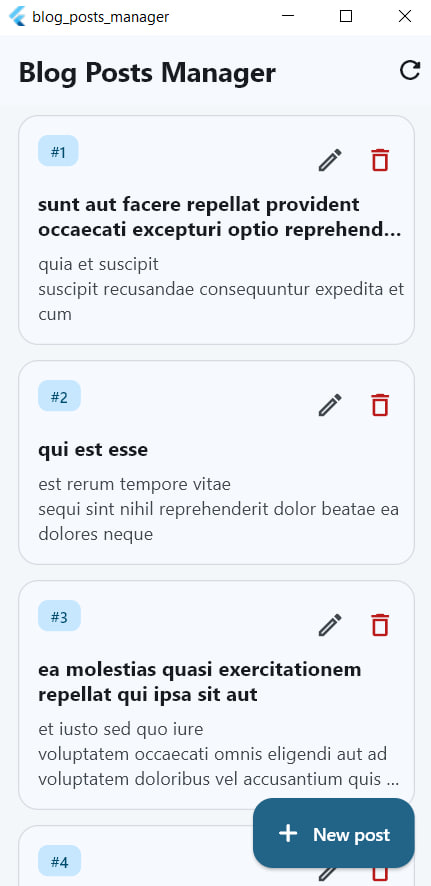
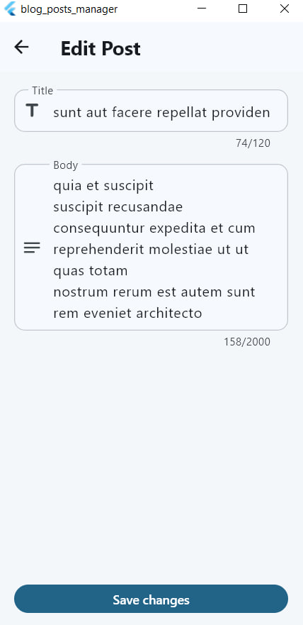
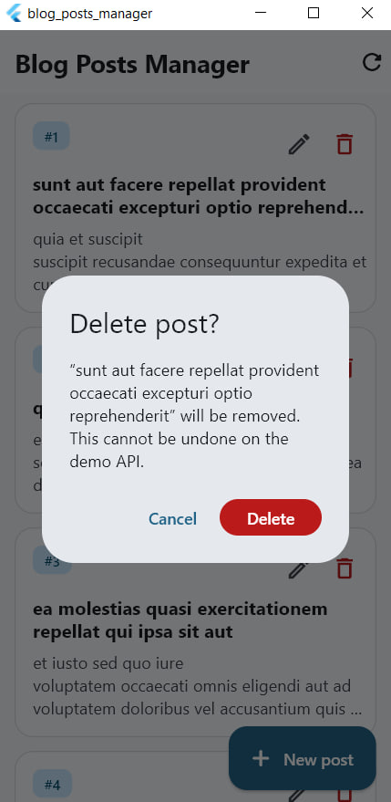
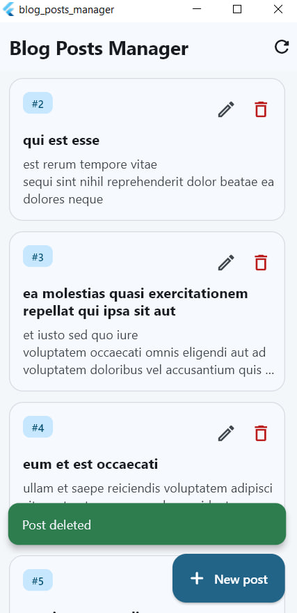
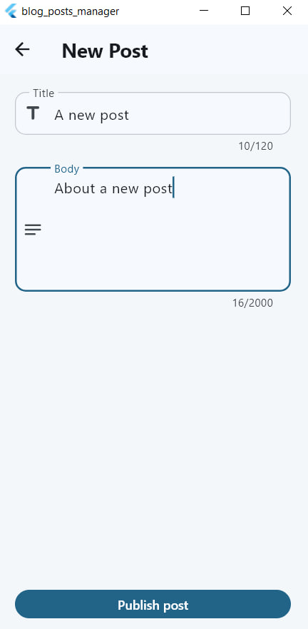
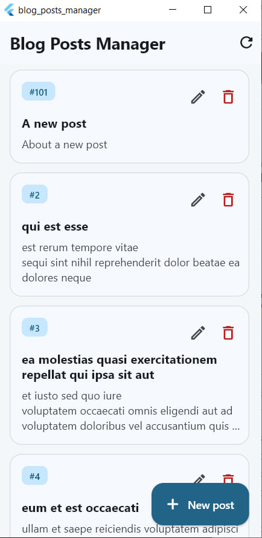

# Blog Posts Manager

A Flutter CRUD application for managing blog posts against the [JSONPlaceholder](https://jsonplaceholder.typicode.com/) REST API. The app uses **Provider** for state management, the **http** package for networking, and a layered folder structure so UI, state, and API concerns stay separated.

## Features

- Fetch and display all posts
- Create a new post (FAB → form)
- Edit an existing post (edit icon on each card)
- Delete a post (with confirmation dialog)
- Loading indicators during fetch and mutations
- Network/API error handling with retry
- Snackbar feedback for success and failure
- Material 3 UI with pull-to-refresh

## Screen Shots Of the UI








## Project structure

```
lib/
├── main.dart                 # App entry, Provider setup
├── models/
│   └── post.dart             # Post data model
├── services/
│   ├── api_exception.dart    # Typed API/network errors
│   └── post_service.dart     # HTTP CRUD calls
├── providers/
│   └── posts_provider.dart   # ChangeNotifier state
├── screens/
│   ├── home_screen.dart      # Post list, FAB, delete flow
│   └── post_form_screen.dart # Create / edit form
├── widgets/
│   ├── post_card.dart
│   ├── post_form_fields.dart
│   ├── loading_view.dart
│   ├── error_view.dart
│   └── empty_posts_view.dart
├── theme/
│   └── app_theme.dart
└── utils/
    └── snackbar_helper.dart
```

## Dependencies

| Package | Purpose |
|---------|---------|
| [provider](https://pub.dev/packages/provider) | `ChangeNotifier` state management |
| [http](https://pub.dev/packages/http) | REST API requests |
| `flutter` / `cupertino_icons` | UI framework and icons |

## Prerequisites

- [Flutter SDK](https://docs.flutter.dev/get-started/install) (stable channel, 3.x+)
- Android Studio / VS Code with Flutter extension, or Xcode for iOS
- An emulator, physical device, or desktop target with internet access

## Setup

1. **Clone the repository**

   ```bash
   git clone <your-repo-url>
   cd Blog-Posts-Manager-
   ```

2. **Install packages**

   ```bash
   flutter pub get
   ```

3. **Verify Flutter setup**

   ```bash
   flutter doctor
   ```

## How to run

List connected devices:

```bash
flutter devices
```

Run on the default device:

```bash
flutter run
```

Run on a specific target (examples):

```bash
flutter run -d chrome
flutter run -d windows
flutter run -d <device-id>
```

Release build (Android APK):

```bash
flutter build apk --release
```

## API note

JSONPlaceholder is a **fake** REST API: create/update/delete requests succeed but do not persist on the server. The app updates its local list immediately so you still see the full CRUD experience in the UI.

Base URL: `https://jsonplaceholder.typicode.com/posts`

## Screenshots

_Add screenshots of your running app here._

| Home — post list | Create / edit form |
|------------------|--------------------|
| `screenshots/home.png` | `screenshots/form.png` |

| Delete confirmation | Error state |
|-----------------------|-------------|
| `screenshots/delete.png` | `screenshots/error.png` |

> Tip: create a `screenshots/` folder in the project root and drop PNG captures from your emulator after `flutter run`.

## Architecture overview

```
Screens  →  Providers (ChangeNotifier)  →  Services (http)  →  JSONPlaceholder
                ↓
            Models (Post)
```

- **Screens** render UI and call provider methods.
- **Providers** hold loading/error/list state and notify widgets.
- **Services** perform `Future`-based HTTP calls and throw `ApiException` on failure.
- **Models** map JSON to strongly typed Dart objects.

## License

This project was built as an educational assignment. Use and modify freely for learning purposes.
